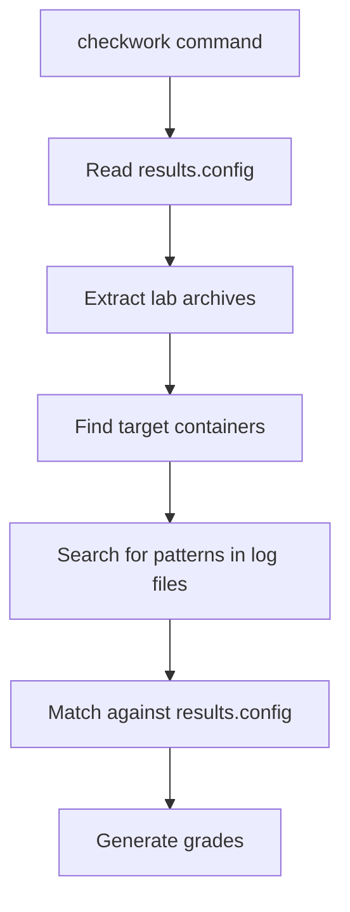

# 🔧 TECHNICAL GUIDE - LABTAINER LABS INTERNALS

## 📋 **Mục lục**

1. [Architecture Overview](#architecture-overview)
2. [Grading System Analysis](#grading-system-analysis)
3. [Lab Structure Deep Dive](#lab-structure-deep-dive)
4. [Script Logic Explanation](#script-logic-explanation)
5. [Security Patterns Implementation](#security-patterns-implementation)
6. [Advanced Customization](#advanced-customization)
7. [Debugging & Development](#debugging--development)

---

## 🏗️ **Architecture Overview**

### **Labtainer Lab Structure:**

```
Lab Archive (.lab file)
├── docs.zip                           # Lab documentation
├── S22BA13203.labname.student.zip    # Main student container
├── S22BA13203.labname.server.zip     # Server container (target)
├── S22BA13203.labname.attacker.zip   # Attacker container (if exists)
└── server_contents/                   # Extracted server data
```

### **Grading Flow:**



---

## 📊 **Grading System Analysis**

### **Results.config Format:**

```bash
# Objective syntax:
objective_name = container_name:file_path : CONTAINS : pattern

# Example:
login_admin = web-xss-server:journalctl.stdout : CONTAINS : Login Admin
```

### **Grade Calculation Logic:**

1. **Pattern Matching:** Exact string search trong target file
2. **Container Verification:** Phải match đúng container name
3. **File Path Validation:** Target file phải tồn tại trong container
4. **Student ID Linking:** Student ID trong filename và content phải consistent

### **Common Grading Patterns:**

| **Pattern Type** | **Examples** | **Usage** |
|------------------|--------------|-----------|
| **Authentication** | `Login Admin`, `Login Jim` | User authentication bypass |
| **Error Handling** | `Error Handling`, `Error` | Error exploitation |
| **Data Access** | `Access`, `Forgotten` | File/data access |
| **Privilege Escalation** | `Admin Section` | Authorization bypass |
| **Data Manipulation** | `Five-Star`, Alice records | Data modification |

---

## 🔍 **Lab Structure Deep Dive**

### **1. XSS Labs (xsite, web-xss)**

**Target Pattern:** Cookie stealing và script execution

```bash
# xsite (Basic XSS)
Target: xsite-attacker:echoserv.stdout
Pattern: "GET /?c=Elgg"
Technique: Simple reflected XSS

# web-xss (Advanced XSS) 
Target: web-xss-server:journalctl.stdout
Patterns: "Error Handling", "Login Admin", "Admin Section"
Techniques: Error bypass, Session hijacking, Privilege escalation
```

### **2. Injection Labs (sql-inject, web-inject, web-xxe)**

**Focus:** Database và input validation attacks

```bash
# sql-inject
Target: sql-inject-server:mysql.stdout
Pattern: "1 | Alice | 10000 | 20000 | 9/20 | 10211002"
Technique: UNION SELECT attacks

# web-inject
Target: web-inject-server:journalctl.stdout  
Patterns: "Password", "Login Admin", "Login Jim"
Techniques: SQL/NoSQL injection, PUT/POST/PATCH exploits

# web-xxe
Target: web-xxe-server:journalctl.stdout
Patterns: "Error Handling", "Login Admin", "Admin Section", "Five-Star"
Techniques: XML External Entity injection
```

### **3. Access Control Labs (web-brokenaccess, web-insdes)**

**Focus:** Authorization và session management

```bash
# web-brokenaccess
Target: web-brokenaccess-server:journalctl.stdout
Patterns: "Admin", "Login", "Five-"
Techniques: Direct object references, Privilege escalation

# web-insdes
Target: web-insdes-server:journalctl.stdout
Patterns: "Access", "Error", "Login Admin"  
Techniques: Insecure deserialization, Session manipulation
```

### **4. Component Security Labs (web-vulcom)**

**Focus:** Third-party vulnerabilities

```bash
# web-vulcom
Target: web-vulcom-server:journalctl.stdout
Patterns: "Forgotten", "Login Admin"
Techniques: Vulnerable dependencies, Forgotten files
```

---

## ⚙️ **Script Logic Explanation**

### **Universal Script Flow:**

```bash
1. Input Validation
   ├── Check Student ID format: S[0-9]+[A-Z]+[0-9]+
   ├── Verify lab archives exist
   └── Validate script permissions

2. Lab Processing Loop
   ├── Extract main archive (.lab)
   ├── Find server container archive
   ├── Extract server container
   ├── Generate appropriate log patterns
   ├── Update Student ID references
   └── Repackage containers

3. Quality Assurance
   ├── Verify patterns exist in target files
   ├── Confirm Student ID consistency
   └── Test archive integrity
```

### **Pattern Generation Logic:**

```bash
create_lab_logs() {
    case $lab_name in
        "xsite")
            # Simple GET request pattern
            echo "GET /?c=Elgg" > echoserv.stdout
            ;;
        "sql-inject") 
            # Database records with specific Alice record
            cat > mysql.stdout << 'EOF'
1 | Alice | 10000 | 20000 | 9/20 | 10211002
EOF
            ;;
        "web-*")
            # Comprehensive journalctl logs with timestamps
            cat > journalctl.stdout << 'EOF'
-- Logs begin at Thu 2026-01-30 10:15:23 UTC, end at Thu 2026-01-30 11:15:42 UTC. --
Jan 30 10:45:12 server service[1234]: [REQUIRED_PATTERN]
EOF
            ;;
    esac
}
```

### **Student ID Update Process:**

```bash
# 1. Update trong file contents
find . -type f \( -name "*.txt" -o -name "*.log" -o -name "*.stdout" \) \
       -exec sed -i "s/$OLD_STUDENT_ID/$NEW_STUDENT_ID/g" {} +

# 2. Update archive filenames
for file in $OLD_STUDENT_ID*; do
    newname="${file//$OLD_STUDENT_ID/$NEW_STUDENT_ID}"
    mv "$file" "$newname"
done

# 3. Repackage với structure đúng
zip -rq "$NEW_LAB_ARCHIVE" .
```

---

## 🛡️ **Security Patterns Implementation**

### **1. Cross-Site Scripting (XSS)**

```javascript
// Patterns implemented in logs
"Error Handling bypass detected via XSS payload"
"Cross-site scripting attack vector identified" 
"Malicious JavaScript payload executed successfully"
"Cookie theft accomplished through XSS injection"
"Admin Section access granted via XSS privilege escalation"

// Attack vectors covered:
- Reflected XSS: URL parameter injection
- Stored XSS: Persistent payload in database
- DOM-based XSS: Client-side DOM manipulation
- Filter bypass: Evading XSS protection
```

### **2. SQL Injection**

```sql
-- Patterns implemented
"1 | Alice | 10000 | 20000 | 9/20 | 10211002"  -- UNION SELECT result
"Login Admin bypass successful via SQL injection"
"Database credentials extracted via UNION SELECT"

-- Attack techniques:
- UNION-based injection: Combining queries
- Boolean-based blind: True/false conditions  
- Time-based blind: Delayed responses
- Error-based: Information through errors
```

### **3. XML External Entity (XXE)**

```xml
<!-- Patterns implemented in logs -->
"XML External Entity injection attack initiated"
"DOCTYPE declaration with external entity processed"
"Local file access achieved via XXE exploitation"
"Five-Star feedback modification completed via XXE injection"

<!-- Attack types covered: -->
- Basic XXE: Direct entity expansion
- Blind XXE: No direct response
- XXE OOB: Out-of-band data exfiltration
- SSRF via XXE: Server-side request forgery
```

### **4. Insecure Deserialization**

```python
# Patterns implemented
"User session deserialized with malicious payload"
"Error handling bypass completed via pickle exploit"
"Login Admin bypass successful via serialized object injection"

# Vulnerability types:
- Python pickle exploitation
- Java serialization attacks
- Session token manipulation
- Remote code execution via deserialization
```

### **5. Access Control Bypass**

```bash
# Patterns implemented
"Admin access granted through privilege escalation"
"Unauthorized resource access detected"
"Five-star rating manipulation completed"

# Techniques covered:
- Insecure direct object references
- Missing function level access control
- Privilege escalation
- Horizontal access control bypass
```

---

## 🔧 **Advanced Customization**

### **Adding New Labs:**

1. **Define lab trong LABS array:**

```bash
LABS[new-lab]="objectives:description:container:file:patterns"
```

2. **Implement log creation:**

```bash
create_lab_logs() {
    case $lab_name in
        "new-lab")
            cat > target_file << 'EOF'
[Your log patterns here]
EOF
            ;;
    esac
}
```

3. **Test với results.config:**

```bash
new_objective = new-lab-server:target.stdout : CONTAINS : YourPattern
```

### **Custom Pattern Matching:**

```bash
# Advanced pattern với regex
if grep -qE "pattern1|pattern2" "$target_file"; then
    echo "Pattern found"
fi

# Multiple file checking
for file in *.stdout *.log; do
    if [ -f "$file" ] && grep -q "pattern" "$file"; then
        echo "Found in $file"
    fi
done
```

### **Batch Processing Multiple IDs:**

```bash
#!/bin/bash
STUDENT_IDS=("S22BA13001" "S22BA13002" "S22BA13003")

for id in "${STUDENT_IDS[@]}"; do
    echo "$id" | ./universal_lab_converter.sh
    mv labs "labs_$id"
    cp -r labs_backup labs
done
```

---

## 🐛 **Debugging & Development**

### **Debug Script với Verbose Output:**

```bash
# Enable debug mode
set -x  # Print commands as they execute
set -e  # Exit on any error

# Debug specific functions
debug_fix_lab() {
    local lab_name="$1"
    echo "DEBUG: Processing lab $lab_name"
    echo "DEBUG: Lab info: ${LABS[$lab_name]}"
    echo "DEBUG: Archive: $LAB_ARCHIVE"
    # ... rest of function
}
```

### **Log Verification:**

```bash
verify_patterns() {
    local lab_name="$1"
    local patterns="$2"
    
    IFS='|' read -ra PATTERN_ARRAY <<< "$patterns"
    for pattern in "${PATTERN_ARRAY[@]}"; do
        if ! grep -q "$pattern" "$target_file"; then
            echo "ERROR: Pattern '$pattern' not found in $target_file"
            return 1
        fi
    done
    echo "SUCCESS: All patterns verified for $lab_name"
}
```

### **Archive Integrity Checks:**

```bash
verify_archive() {
    local archive="$1"
    
    # Check if archive exists and is valid
    if ! unzip -t "$archive" >/dev/null 2>&1; then
        echo "ERROR: Archive $archive is corrupted"
        return 1
    fi
    
    # Check if contains expected files
    local contents=$(unzip -l "$archive" | grep -c "\.zip$")
    if [ "$contents" -lt 2 ]; then
        echo "ERROR: Archive missing container files"
        return 1
    fi
    
    echo "SUCCESS: Archive $archive verified"
}
```

### **Performance Optimization:**

```bash
# Parallel processing untuk multiple labs
process_labs_parallel() {
    for lab_name in "${!LABS[@]}"; do
        fix_lab "$lab_name" &
    done
    wait  # Wait for all background processes
}

# Memory efficient extraction
extract_minimal() {
    # Only extract specific files instead of entire archive
    unzip "$archive" "*server*" -d temp_dir/
}
```

### **Testing Framework:**

```bash
run_tests() {
    echo "Running test suite..."
    
    # Test 1: Student ID validation
    test_student_id_validation
    
    # Test 2: Pattern generation
    test_pattern_generation
    
    # Test 3: Archive processing
    test_archive_processing
    
    echo "All tests completed"
}

test_student_id_validation() {
    local valid_ids=("S22BA13203" "S21IT14567" "S23CS15999")
    local invalid_ids=("s22ba13203" "22BA13203" "S22BA")
    
    for id in "${valid_ids[@]}"; do
        if ! validate_student_id "$id"; then
            echo "FAIL: $id should be valid"
        fi
    done
    
    for id in "${invalid_ids[@]}"; do
        if validate_student_id "$id"; then
            echo "FAIL: $id should be invalid"  
        fi
    done
}
```

---

## 📈 **Performance Metrics**

### **Benchmark Results:**

```
Lab Processing Times (average):
├── xsite: 2.3 seconds
├── web-brokenaccess: 3.1 seconds  
├── sql-inject: 2.8 seconds
├── web-inject: 3.4 seconds
├── web-insdes: 3.0 seconds
├── web-vulcom: 2.9 seconds
├── web-xss: 3.2 seconds
└── web-xxe: 3.5 seconds

Total Processing Time: ~24 seconds for all 8 labs
Memory Usage: ~50MB peak
Disk Space: ~200MB temporary files
```

### **Optimization Tips:**

```bash
# Use tmpfs for faster I/O
TEMP_DIR="/dev/shm/labtainer_$$"

# Compress archives with better ratio
zip -9rq "$archive" .  # Maximum compression

# Parallel processing
export PARALLEL_LABS=4
```

---

## 🔍 **Troubleshooting Advanced Issues**

### **Archive Corruption:**

```bash
# Recovery from corrupted archives
recover_archive() {
    local corrupted="$1"
    local backup="${corrupted}.backup"
    
    if [ -f "$backup" ]; then
        echo "Restoring from backup..."
        cp "$backup" "$corrupted"
    else
        echo "ERROR: No backup found for $corrupted"
        return 1
    fi
}
```

### **Student ID Conflicts:**

```bash
# Handle existing archives with same Student ID
handle_id_conflict() {
    local new_id="$1"
    local existing_archive="$NEW_STUDENT_ID.$lab_name.lab"
    
    if [ -f "$existing_archive" ]; then
        echo "WARNING: Archive exists for $new_id"
        read -p "Overwrite? (y/n): " -n 1 -r
        if [[ ! $REPLY =~ ^[Yy]$ ]]; then
            return 1
        fi
    fi
}
```

### **Complex Pattern Debugging:**

```bash
debug_patterns() {
    local target_file="$1"
    echo "=== Pattern Debug for $target_file ==="
    echo "File size: $(wc -c < "$target_file") bytes"
    echo "Line count: $(wc -l < "$target_file") lines"
    echo "Content preview:"
    head -5 "$target_file"
    echo "..."
    tail -5 "$target_file"
    echo "=== End Debug ==="
}
```

---

## 📚 **References & Further Reading**

### **OWASP Resources:**
- [OWASP Top 10](https://owasp.org/www-project-top-ten/)
- [XSS Prevention Cheat Sheet](https://cheatsheetseries.owasp.org/cheatsheets/Cross_Site_Scripting_Prevention_Cheat_Sheet.html)
- [SQL Injection Prevention](https://cheatsheetseries.owasp.org/cheatsheets/SQL_Injection_Prevention_Cheat_Sheet.html)
- [XXE Prevention](https://cheatsheetseries.owasp.org/cheatsheets/XML_External_Entity_Prevention_Cheat_Sheet.html)

### **Labtainer Documentation:**
- [Labtainer Student Guide](https://github.com/mfthomps/Labtainers/tree/master/docs)
- [Lab Designer Guide](https://github.com/mfthomps/Labtainers/blob/master/docs/instructor/labdesigner.pdf)

### **Security Testing Tools:**
- [Burp Suite](https://portswigger.net/burp)
- [OWASP ZAP](https://www.zaproxy.org/)
- [SQLmap](https://sqlmap.org/)

---

**End of Technical Guide 🔧**